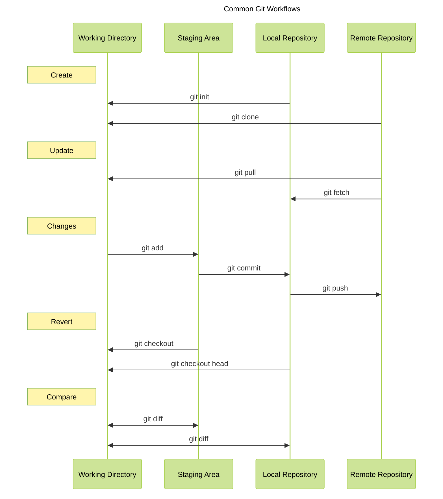

```mermaid
---
title: Common Git Workflows
config:
  theme: "forest"
---
sequenceDiagram
  participant Working Directory
  participant Staging Area
  participant Local Repository
  participant Remote Repository

  rect rgb(255, 255, 255)
  note left of Working Directory: Create
  Local Repository ->> Working Directory: git init
  Remote Repository ->> Working Directory: git clone
  end

  rect rgb(255, 255, 255)
  note left of Working Directory: Update
  Remote Repository ->> Working Directory: git pull
  Remote Repository ->> Local Repository: git fetch
  end

  rect rgb(255, 255, 255)
  note left of Working Directory: Changes
  Working Directory ->> Staging Area: git add
  Staging Area ->> Local Repository: git commit
  Local Repository ->> Remote Repository: git push
  end

  rect rgb(255, 255, 255)
  note left of Working Directory: Revert
  Staging Area ->> Working Directory: git checkout
  Local Repository ->> Working Directory: git checkout head
  end

  rect rgb(255, 255, 255)
  note left of Working Directory: Compare
  Working Directory <<->> Staging Area: git diff
  Working Directory <<->> Local Repository: git diff
  end
```
