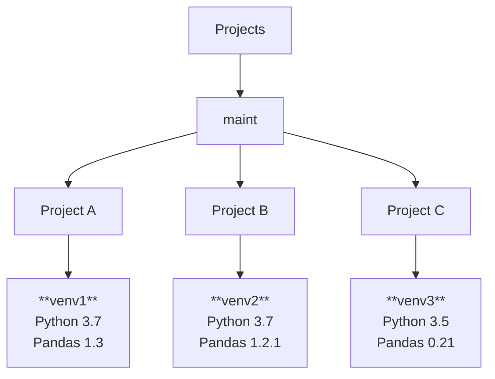

# Packaging ML Models

Modularising Python code and building packages which can be used elsewhere, so that deployment and testing can work better.

## Objectives

- Building and Managing Virtual Environments
  - managing packages and dependencies
- Testing Python code using pytest
- Serialising and deserialising ML Models
- Developing, Building, Deploying ML Packages

## Virtual Environments

Isolate packages and their dependencies to create reproducible environments in which to run code.



Python has a built in virtual environment tool `venv` which you can install on Ubuntu with `apt-get`:
```
sudo apt-get install python3.12-venv    # use the appropriate python version
```
Now you can call the `venv` module to create the virtual environment `my_env`:
```
python -m venv my_env
```
Or if you already installed `uv` and did a `uv init` in the current directory to create a `uv` project:
```
uv venv my_env
```
Activate the `my_env` environment:
```
source my_env/bin/activate
```
You should see `(my_env)` appear before your prompt, which means you're in the virtual environment.
To see the packages installed in it, you can use Python's in-built package manager `pip`:
```
pip list        # either of these
pip freeze      # should work
```
Or with `uv`:
```
uv pip list     # either of these
uv pip freeze   # should work
```

To leave the virtual environment in either `pip` or `uv`, just deactivate it:
```
deactivate
```

To install a package, e.g. `pandas`, into the current environment with `pip`:
```
pip install pandas
```
With `uv`, we need to specify `--active` since it expects the virtual environment to be in `.venv`, not `my_env`:
```
uv add --active pandas
```

To create a requirements file so that the contents of this virtual environment can be reproduced, run:
```
pip freeze -l > requirements.txt
```
Once the `requirements.txt` file is created on the target machine, we can commit and push this to track it with `git`.
On the target machine, to reproduce the setup, we can install from it with:
```
pip install -r requirements.txt
```
Note that the `requirements.txt` needs to be manually regenerated as packages are installed or removed.

Using `uv` the process is slightly different, as it creates a `uv.lock` once packages have been installed.
Providing the `uv.lock` contains the correct contents, we just need to **synchronise** the contents of the
current virtual environment with the lockfile:
```
uv sync
```
As long as `uv.lock` is tracked by `git`, it should be up to date.

`uv` can also create a `requirements.txt` in case the target machine uses only `pip`:
```
uv pip freeze -l > requirements.txt     # on the source machine
uv pip install -r requirements.txt      # on the target machine
```

## Serialising/Deserialising ML models

This is the process of converting machine learning models from their binary object form into a series of bytes for storage or transmission.

We will use a simple example object for this illustration. Save the following file as `data.py`:
```
students = {
    "names": ["Amy", "Bob", "Cal"],
    "scores": [20, 25, 15]
}
```

Using the built-in Python module `pickle`, we need to create a file, write the bytes to it, then read the contents back:
```
import pickle
from data import students

with open("students.data", "wb") as s_write:
    pickle.dump(students, s_write)

with open("students.data", "rb") as s_read:
    students_from_file = pickle.load(s_read)

print(students == students_from_file)
```

You can do the same thing using `joblib`, which is slightly more convenient:
```
import joblib
from data import students

joblib.dump(students, "stu_data")               # stores `students` into a file called `stu_data`
students_from_file = joblib.load("stu_data")    # loads the contents of `stu_data` back into an object

print(students == students_from_file)
```
The code is provided as `pickle_demo.py`, `joblib_demo.py`, and `data.py` in this folder.
